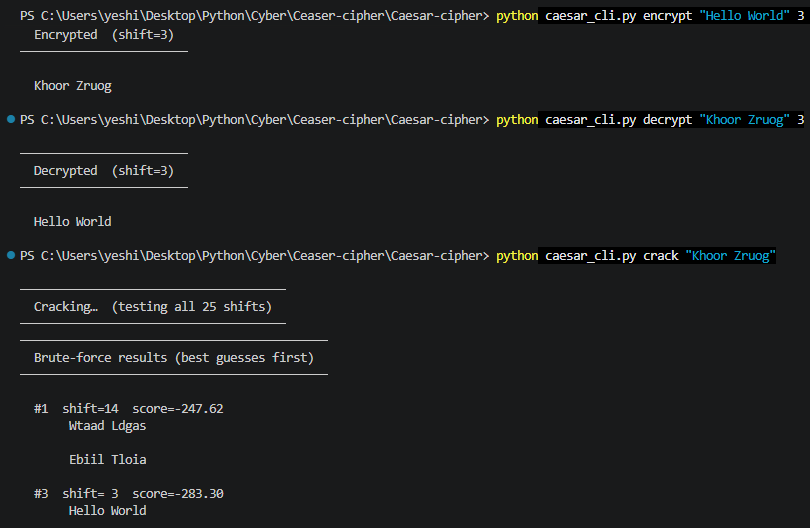
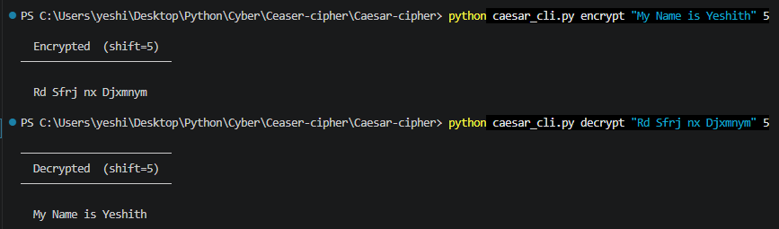
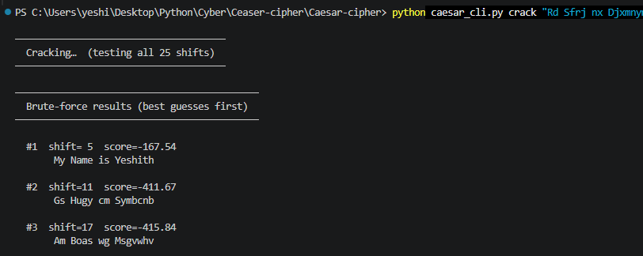

# Caesar Cipher Tool

A Python library and CLI for encrypting, decrypting, and brute-force cracking Caesar ciphers.

## Features

- **Encrypt** any text with a shift key (1–25)
- **Decrypt** with the known key
- **Brute-force crack** — ranks all 25 candidates using letter-frequency analysis and common-word matching
- Preserves case, digits, punctuation, and spaces
- Fully tested with pytest

## Quick Start

```bash
# Clone and enter the repo
git clone https://github.com/your-username/caesar-cipher.git
cd caesar-cipher

# No external dependencies — pure stdlib. Optional: install pytest for tests.
pip install pytest

# Run tests
pytest tests/ -v

# Encrypt
python caesar_cli.py encrypt "Meet me at midnight" 7

# Decrypt
python caesar_cli.py decrypt "Tlla tl ha tpkupnoa" 7

# Crack (brute-force, shows top 3 guesses)
python caesar_cli.py crack "Khoor, Zruog!"

# Crack with more candidates
python caesar_cli.py crack "Khoor, Zruog!" --top 5
```

## Library API

```python
from src.caesar import encrypt, decrypt, brute_force, score_text

# Encrypt
cipher = encrypt("Hello, World!", 13)          # → "Uryyb, Jbeyq!"

# Decrypt
plain  = decrypt("Uryyb, Jbeyq!", 13)          # → "Hello, World!"

# Brute-force crack — returns top-N candidates sorted by score
results = brute_force("Khoor, Zruog!", top_n=3)
for r in results:
    print(r["shift"], r["score"], r["plaintext"])

# Score arbitrary text (higher = more English-like)
s = score_text("The quick brown fox")
```

## How the cracker works

1. **Try all 25 shifts** — decrypt with each key from 1 to 25.
2. **Score each candidate** using two signals:
   - *Letter frequency* — chi-squared distance from expected English frequencies (e, t, a, o, i, n, …)
   - *Common word count* — count occurrences of the 50 most common English words
3. **Rank by score** — the highest-scoring candidate is the best guess.

## Project layout

```
caesar-cipher/
├── src/
│   └── caesar.py        # Core library (no dependencies)
├── tests/
│   └── test_caesar.py   # pytest test suite
├── caesar_cli.py         # CLI entry point
└── README.md
```

## Running tests

```bash
pytest tests/ -v
```

## Preview






